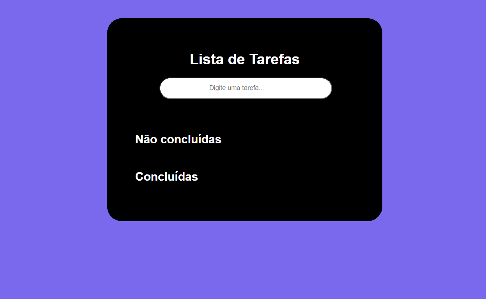

## Lista de Tarefas 📝
Nesta página web, podemos inserir tarefas no campo de texto e ao teclar no Enter ela é inserida na sessão de Não concluídas, ao concluir a tarefa, com apenas um clique emcima desta ela é movida para a sessão das tarefas que já foram realizadas na sessão Concluídas. Neste projeto explorei conceitos de estrutura, estilização, eventos e afins.

## Desafio ❗
O grande desafio que encontrei neste projeto foi desenvolver os eventos com JavaScript e JQuery, pretendo continuar aprendendo e me desenvolvendo ainda mais nos próximos projetos.

## Tecnologias utilizadas 💻

 
    
    
    
    

## Vizualização ✨
Pode acessar a página através do link a seguir: https://emanuelly-wolski.github.io/lista-de-tarefas/
[]
